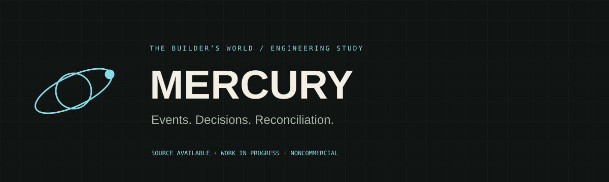
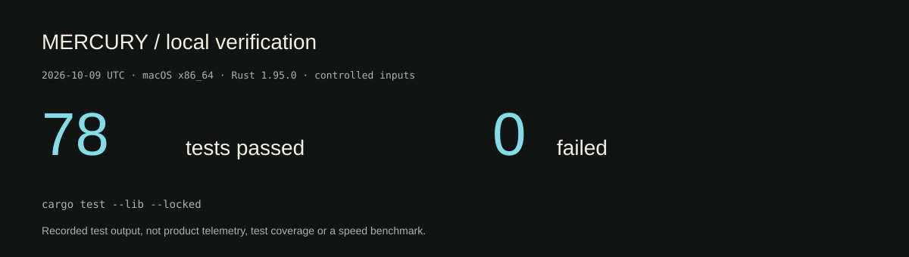
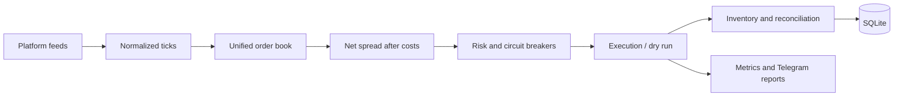

<p>   </p>

# MERCURY

**A Rust research engine for multi-platform events, risk gates and reconciliation.**

MERCURY explores prediction-market integration: feed adapters produce normalized ticks; books and net-spread calculations identify candidate opportunities; risk rules and execution paths handle decisions, partial failures and inventory. Its focus differs from ARGUS: **cross-platform orchestration**, rather than market-data storage/replay foundations.

[Case study](https://isaacvaleriano.netlify.app/en/projects/mercury/) · [Architecture](docs/ARCHITECTURE.md) · [Verification](docs/VERIFICATION.md) · [Roadmap](docs/ROADMAP.md) · [Português](README.pt-BR.md)

## Verifiable engineering results

| Evidence | Result | Reproduce / inspect |
|---|---:|---|
| Offline library tests | **79 passed · 0 failed** | `cargo test --lib --locked`; [run record](docs/VERIFICATION.md) |
| Integration scenarios | **20 test functions** | [integration.rs](src/integration.rs) |
| Platform adapter families | **4** | Polymarket / Kalshi / CDNA / ForecastEx in [feeds](src/feeds/) |
| Persistent inventory | **SQLite + migrations** | [database layer](src/db/) |
| Alert format | **Versioned snapshots** | [Telegram snapshots](src/telegram/snapshots/) |

Adapter code existing is not the same as a production-certified integration. Offline tests use controlled inputs and mocks. There are **no published live trading gains, live order-execution results or calibrated risk guarantees**.



## Architecture




- **Asynchronous orchestration:** Tokio tasks, broadcast/mpsc channels, cancellation and trait-based clients.
- **Book and pricing:** normalized identifiers, quantities, timestamps and Decimal arithmetic. Cost estimates include fees, depth/slippage and supported chain-cost paths.
- **Risk:** bankroll state, sizing, exposure/drawdown limits, stale-feed rejection and circuit-breaker states.
- **Execution:** opportunity deduplication, dry-run logic, rate-limit handling, partial-result modeling and unwind paths. Cross-venue execution is not atomic.
- **Inventory:** positions, settlement monitoring, reconciliation and a watchdog; SQLx-backed SQLite persists state.
- **Operations:** health, tracing, counters and Telegram message formatting. There is **no web dashboard** in this repository.

## Get started safely

Rust stable/Cargo plus native TLS build prerequisites are needed (macOS: Xcode command-line tools; Linux: a C/C++ compiler, pkg-config and OpenSSL development headers).

```bash
git clone https://github.com/yMScorpion/MERCURY.git
cd MERCURY
# Offline engineering checks; no credentials, feeds or orders are needed:
cargo test --lib --locked
cargo build --locked
```

A separate manual research mode exists:

```bash
cargo run --release -- --config config/dry_run.yaml --dry-run
```

**This is not an offline simulator.** The binary performs external preflight checks and connects to configured feeds; enabled Telegram and signing/authentication paths may require configuration. Inspect [configuration](config/dry_run.yaml) and [Getting started](docs/GETTING_STARTED.md) before using it. Do not add real secrets to tracked files. `--dry-run` is an execution setting, not a blanket guarantee that all external side effects are disabled.

## What the tests exercise

The integration module covers detection, tight-spread rejection, stale data, loss halts, sizing caps, old-sequence rejection, inventory/database round trips, near-expiry gating, path validation and chaos scenarios for concurrent reservations, sentinel ticks, out-of-order updates and settlement. Individual modules add feed parsing, risk checks, snapshots and properties.

The initial local run found one stale Telegram snapshot: the formatter included an opportunity ID and the saved snapshot did not. The expectation was reviewed against the implementation and updated; **all 79 tests then passed**. This correction and the exact reproduction command are recorded in [Verification](docs/VERIFICATION.md).

## Portability correction found by CI

Linux CI revealed that a broad filesystem-prefix check accepted `/tmp/evil.db`, while the original test happened to reject it on macOS because `/tmp` canonicalizes differently. Backup destinations now must stay inside the database’s own `backups/` root, using path-component comparisons. A new regression scenario checks a valid backup, an outside path, a sibling prefix trap and a symlink escape. The final local library suite passes **79 tests**; the same command runs in GitHub Actions.

## Roadmap

| Stage | Implemented | Still required |
|---|---|---|
| Data ingestion | Four adapter families, discovery and normalization | Controlled connectivity/contract tests for each venue |
| Detection | Unified book and net-cost evaluation | Validate market equivalence and cost calibration |
| Risk | Exposure/loss/staleness breakers and sizing | Independent invariant review and restart/recovery scenarios |
| Execution | Dry-run/client interfaces, dedup/backoff, partial failure paths | Sandbox evidence for both legs and unwind/reconciliation |
| Inventory | SQLite persistence, settlement and watchdog paths | Long-running failure injection and reconciliation reports |
| Operations | Health, metrics, Telegram alert/report formats | Repeatable deployment, measured service objectives and optional dashboard |

[Detailed acceptance criteria](docs/ROADMAP.md). The repository is a work in progress; avoid interpreting a version label as operational readiness.

## Documentation

[Architecture](docs/ARCHITECTURE.md) · [Getting started](docs/GETTING_STARTED.md) · [Verification record](docs/VERIFICATION.md) · [Roadmap](docs/ROADMAP.md) · [Design decisions](docs/adr/docs/adr/)

## License

Isaac’s original project is **source available under [PolyForm Noncommercial 1.0.0](LICENSE)**. Review the full terms; commercial use requires separate permission. Dependencies retain their respective licenses. This research artifact is not an investment recommendation.

Built by [Isaac Valeriano](https://github.com/yMScorpion). Behind every line of code, there is a builder.
