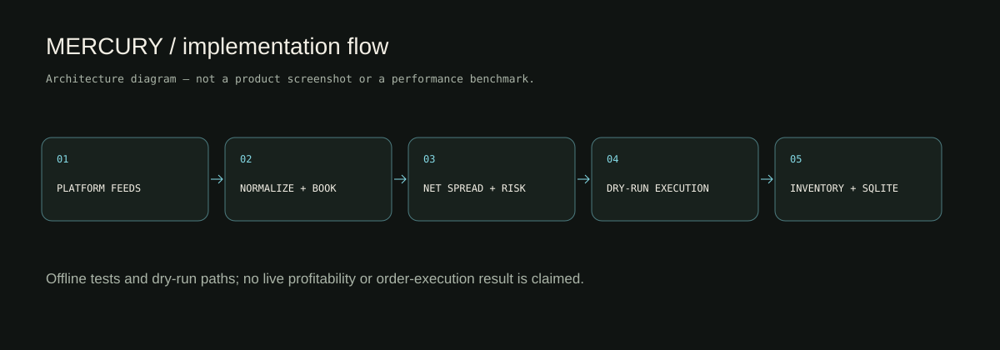
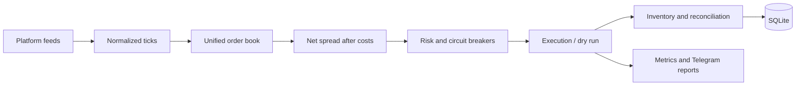

# MERCURY architecture

- **Asynchronous orchestration:** Tokio tasks, broadcast/mpsc channels, cancellation and trait-based clients.
- **Book and pricing:** normalized identifiers, quantities, timestamps and Decimal arithmetic. Cost estimates include fees, depth/slippage and supported chain-cost paths.
- **Risk:** bankroll state, sizing, exposure/drawdown limits, stale-feed rejection and circuit-breaker states.
- **Execution:** opportunity deduplication, dry-run logic, rate-limit handling, partial-result modeling and unwind paths. Cross-venue execution is not atomic.
- **Inventory:** positions, settlement monitoring, reconciliation and a watchdog; SQLx-backed SQLite persists state.
- **Operations:** health, tracing, counters and Telegram message formatting. There is **no web dashboard** in this repository.

## Verification boundary

The implementation diagram describes inspected source paths. It is not a screenshot, a production deployment claim or a measured latency/throughput result. See [verification](VERIFICATION.md) and [roadmap](ROADMAP.md).
